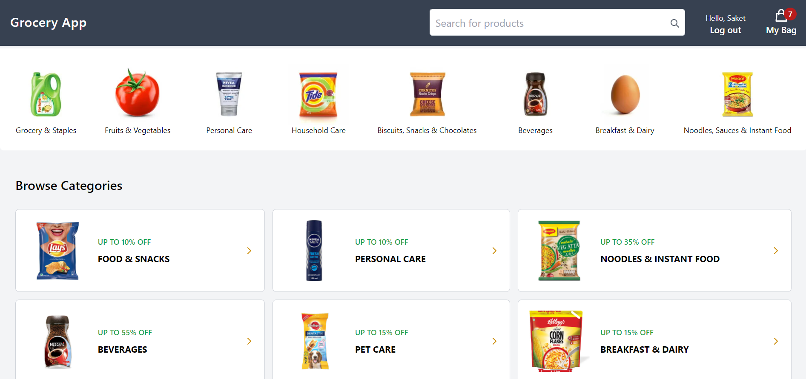
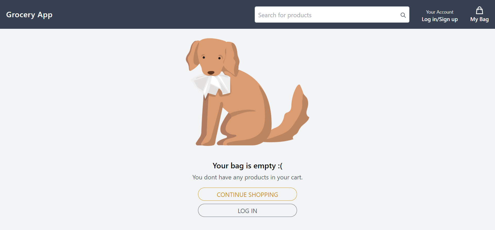
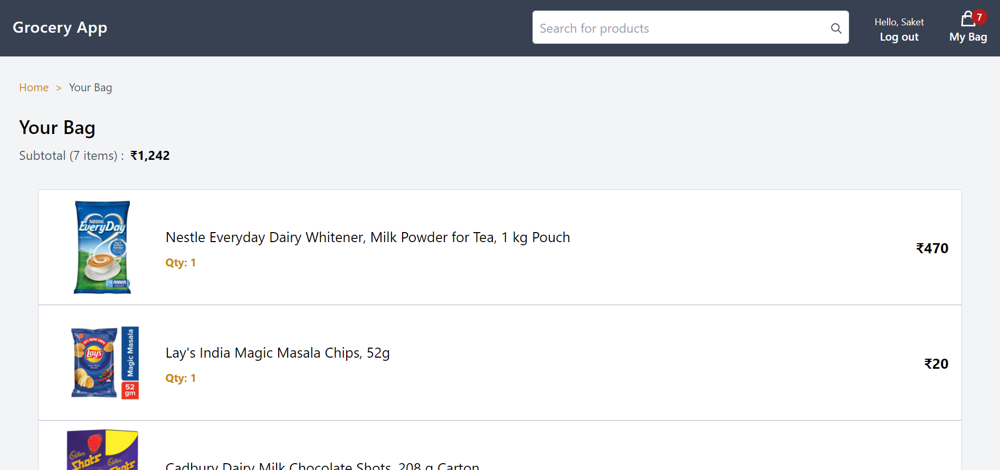
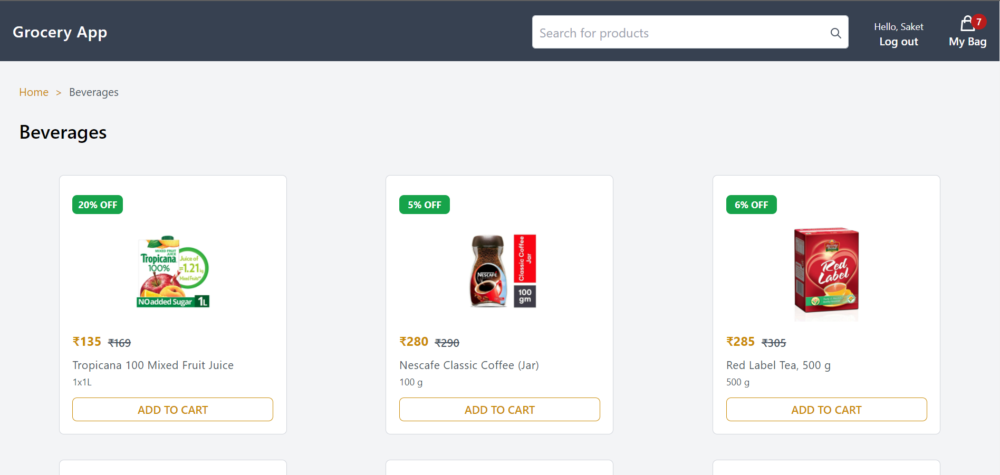
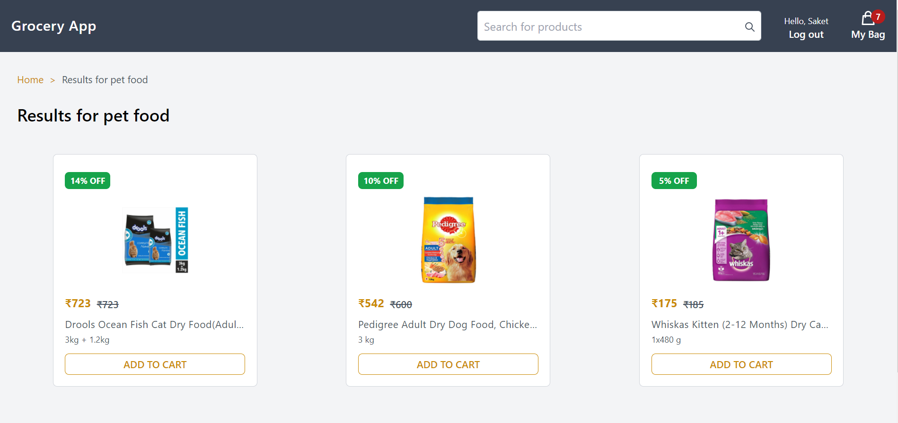
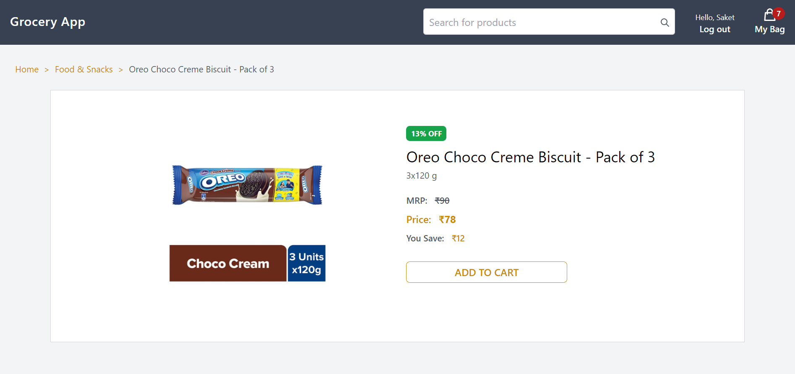

## Next Grocery

## Todos

- [x] Optimise images by using Next's custom `<Image/>` tag.

- [x] Add loader/spinner animation.

- [x] Create a custom Error page.

## Overview

- Grocery app UI built on Next.js, MySQL, Typescript and TailwindCSS.

- Users can register/log in and choose from products ranging from food and staples to personal care. Items can be added to cart and users can see their total order amount and related details.

- Data of products used here can be found in the `products.dummy.ts` file. Most of it was sourced from Amazon India and Grofers.

- The app is live [here](http://next-grocery.vercel.app/)

## Screenshots


<br/> 
<br/>

<br/>

<br/>

<br/>

<br/>

<br/>

## Installation

- Clone and install dependencies locally
```
    git clone https://github.com/saket2508/next-grocery.git
    cd next-grocery
    npm install
```

- Make sure you have installed Node and MySQL in your system.

- Add your database credentials and JWT secret key in a `.env.local` file in this format:
```
    DB_USER =
    DB_HOST =
    DB_PORT =
    DB_NAME =
    DB_PASSWORD =
    JWT_SECRET =
```

- I am using Planetscale for hosting my database in production, but you can feel free to use any cloud provider of your choice. Just remember to add the config info in a `.env.production` file.

- To connect to your database and create the necessary tables, run the migration script in `scripts/migration-db.js` in the terminal.
```
    npm run migrate
```

- Once the db and tables are set up, start the next app by running `npm run dev`